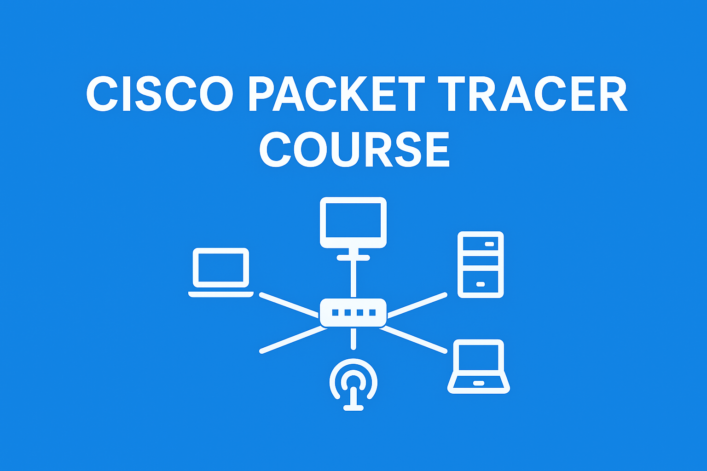

# 🚀 Cisco Packet Tracer Course

 

  

A collection of basic to intermediate simulations to understand **computer networking** using **Cisco Packet Tracer**.  
This documentation covers interface configuration, topologies, and server simulations.

---

## 📚 Course Contents
- 💻 Interface  
- 🔌 Connection Between 2 Computers  
- 🌐 Star Topology with Switch  
- 🔗 Connection Between 2 Switches  
- 📡 Connection Between 2 Switches with Router  
- 📶 Wireless Connection  
- 🔄 Connect Wireless to Wired  
- 🏷️ Simulate DHCP  
- 📧 Simulate Email Server  
- 📂 Simulate FTP  
- 🌍 Simulate HTTP
- Next Last

---

## 🎥 References
📌 [Learn Full Course](https://youtu.be/ty0HMs48U1k?si=oRu7xAE7oOrg15qX)  
📌 [Playlist Course](https://www.youtube.com/watch?v=OOA7uqSvBNI&list=PLVFyjfF2Drdt9hXs37KTPTIqtNVCXFfOG)

---

## 🛠️ Tools
- Cisco Packet Tracer  
- Basic Networking Knowledge  

---

## 🙏 Thanks
Thanks for visiting! Hopefully, this repository helps you learn computer networking effectively.
